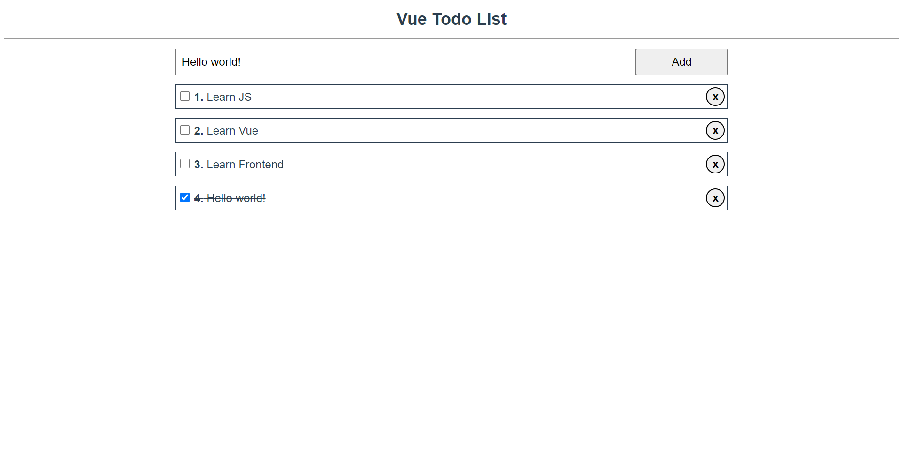

# ToDoList

Basic implementation of TodoList with **Vue.js** framework.

## Screenshot:

<table>
    <tr>
        <td></td>
        <td></td>
        <td></td>
        <td></td>
        <td></td>
        <td></td>
    </tr>
</table>